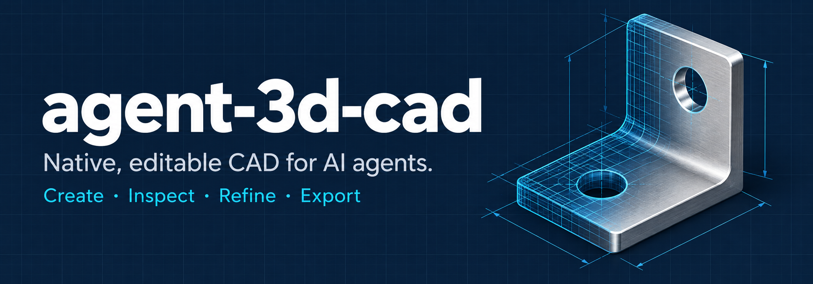

# Agent CAD

Create and refine editable CAD projects in your chat. Inspect faces and edges,
reopen saved designs, and export STEP, STL and PDF/SVG/DXF drawings.
The native CAD engine runs on your computer; the interactive viewer runs inside
an MCP Apps host. No Python, Node, Rust or compiler is needed to use a package.

**We are building toward 1.0 for ChatGPT desktop and Claude Desktop.**
The [published 0.1.0-preview.1](https://github.com/cfaulkingham/agent-3d-cad/releases/tag/v0.1.0-preview.1)
is a development preview. It has not passed the complete installation and
in-chat workflow in both hosts. [1.0 acceptance and current status](docs/RELEASE_1_0.md).

## Install in Claude Desktop

Claude uses a self-contained `.mcpb` extension containing the CAD engine and
embedded viewer. You do not need a standalone viewer application.

1. Download the `.mcpb` for your Mac or Windows PC from
   [Releases](https://github.com/cfaulkingham/agent-3d-cad/releases).
2. Open Claude **Settings → Extensions → Advanced settings → Install extension**
   and select the file.
3. Enable Agent CAD and start a new chat.

The published preview still asks you to select a project folder and requires the
matching CPU build. The next extension build defaults to **Documents/Agent CAD**
with an optional folder setting for existing projects. Host installation,
publisher signing and automatic architecture selection remain 1.0 gates.
[Claude's extension guide](https://support.claude.com/en/articles/10949351-getting-started-with-local-mcp-servers-on-claude-desktop).

## Install in ChatGPT desktop

The local plugin package contains the native engine, embedded viewer and setup
workflow. Its source and packaging are implemented; an end-user installer and
actual host acceptance are still in development. It is **not yet listed in the
public plugin directory**. We will keep CAD local.

Local marketplace testing is documented in [the 1.0 delivery plan](docs/RELEASE_1_0.md).
OpenAI currently requires a remote HTTPS endpoint for normal public MCP plugin
submission, or an approved local MCP route. We must resolve that distribution
requirement before promising a public Install button.
[OpenAI plugin packaging](https://developers.openai.com/plugins/build/plugins).

## Create your first project

Once the plugin is connected, ask:

> Create an editable 80 × 50 × 6 mm mounting plate with four mounting holes.
> Save it as mounting_plate and show it. Then make it 8 mm thick and export STEP.

The agent opens the viewer in chat. Select a face or edge, describe an edit in
**Quick Edit**, and send the reference to your chat. Saved changes refresh the
same view. Choose a saved model from the library to return to an older project.

Use **Export** for STEP, STL or 2D drawings. Default drawings use an A4 sheet
with standard views; ask the agent to add dimensions or customize the drawing.
The current embedded viewer reports files saved in the workspace. Convenient
file retrieval through both hosts is still required for 1.0.

Your saved model is the editable source. Exports are separate outputs; exporting
does not replace the project. Failed edits preserve the last committed revision.
Keep the project folder outside the extension installation so updates preserve it.

## Review external files

The current source can review original STEP, STL, 3MF, GLB, DXF and URDF/SDF/SRDF
robot files in the same viewer. Ask your agent to review the file with its actual
SHA-256 and explicit units. `cad_artifact` captures and validates a portable
review; `cad_artifact_show` opens it with source hashes, geometry or semantic
metadata, and format limitations.

These views are read-only. Mesh groups and curves belong to the captured review;
they do not recover original CAD face selectors or editable feature history.
A saved native project remains the editable source. Use `cad_show` to return to
that project, or explicitly import a STEP file with `cad_import` to create an
opaque native feature. Final combined validation and desktop-host acceptance
remain pending. See the [external artifact guide](docs/ARTIFACT_REVIEW.md).

## Other clients and development previews

CLI agents, OpenCode and the standalone Tauri viewer are deferred from the 1.0
install path. Existing preview archives and their manual setup remain documented
in [advanced client setup](docs/GETTING_STARTED.md) and
[distribution](docs/DISTRIBUTION.md).

## More

- [Repository layout and documentation index](docs/README.md)
- [Client setup and troubleshooting](docs/GETTING_STARTED.md)
- [Viewer and saved projects](docs/LIVE_VIEWER.md)
- [External CAD, mesh, drawing and robot review](docs/ARTIFACT_REVIEW.md)
- [Clipping and exploded inspection](docs/PRESENTATION.md)
- [Exact measurements and assembly clearance](docs/MEASUREMENTS.md)
- [Exact planar sections and material caps](docs/SECTIONS.md)
- [Colors, saved review views and PNG captures](docs/APPEARANCE.md)
- [Saved inspection notes and revision-qualified pins](docs/ANNOTATIONS.md)
- [Coordinated mechanism and presentation sequences](docs/PLAYBACK.md)
- [Modeling tools and CLI protocol](docs/PROTOCOL.md)
- [Drawings](docs/DRAWINGS.md) and [assemblies](docs/ASSEMBLIES.md)
- [Manufacturing packages](docs/MANUFACTURING.md): editable source, per-part exports,
  drawings, BOM and a portable manifest
- [Measured fabrication review](docs/FABRICATION_REVIEW.md): explicit process limits,
  geometric evidence and saved-pose clearance/interference
- [Native G-code review](docs/GCODE_REVIEW.md): explicit commanded-path checks,
  preserved original bytes and unknown firmware behavior
- [Native slicing](docs/SLICING.md): explicit installed OrcaSlicer/profile inputs,
  reviewed plans, bounded jobs and real G-code provenance
- [Printer handoff](docs/PRINTER_HANDOFF.md): portable offline plans, native
  re-verification and explicit external installation/machine prerequisites
- [Sourced parts](docs/PURCHASED_PARTS.md): verified STEP identity, reusable
  purchasing provenance and original supplier artifacts
- [Build, test, and contribute](docs/DEVELOPMENT.md)
- [Release process and packaging](docs/DISTRIBUTION.md)

The original code is [MIT-licensed](LICENSE). Third-party components keep their
own licenses; see [NOTICE](NOTICE) and [third-party notices](packaging/THIRD_PARTY.md).
